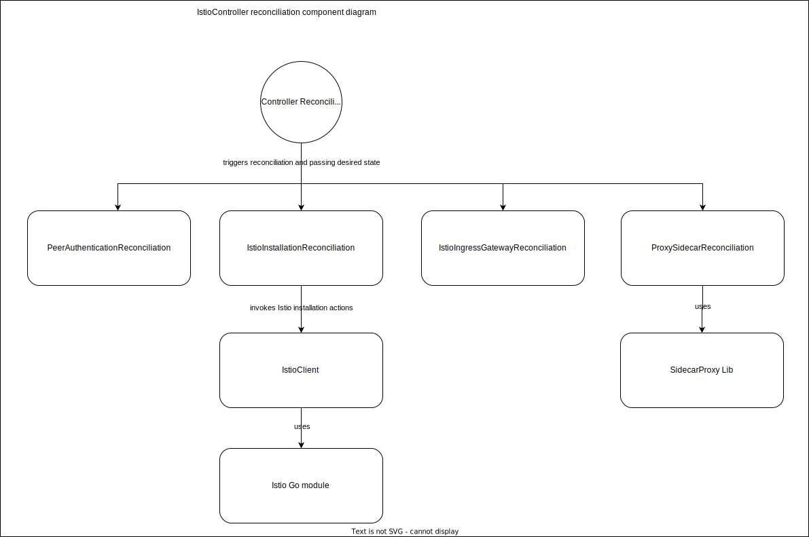

# Technical Design

## Kyma Istio Operator


We want to keep the Kyma Istio operator as simple as possible. That's why we decided to start with one controller that consists of several self-contained components
executing reconciliation logic. The controller uses [Istio CR](https://github.com/kyma-project/istio/blob/main/docs/xff-proposal.md) as a resource.

### Ownership of current resources in Kyma repository

In order to transition to a more modularised architecture, the [IstioOperator resource](https://github.com/kyma-project/kyma/tree/main/resources/istio), 
the [additional istio-resources](https://github.com/kyma-project/kyma/tree/main/resources/istio-resources), and 
the [certificates](https://github.com/kyma-project/kyma/tree/main/resources/certificates) must be moved to the new modules.

#### Istio Operator resource
The Istio Operator resource is moved into the new Kyma Istio Operator. It is used to define default values for Istio, which the user can customise by modyfying Istio CR. 

#### Istio resources

##### Istio Grafana dashboards
It still needs to be decided who will have ownership of the dashboards. To make the right choice, such aspects as the change interval or relevance of Istio version updates should be considered.

##### Istio ServiceMonitor
We do not consider Istio ServiceMonitor in the design, because this resource is planned to be replaced. 
For more information, see this [PR](https://github.com/kyma-project/kyma/pull/16247).

##### istio-healthz Virtual Service
Isito-healthz Virtual Service offers the possibility of monitoring Istio externally by exposing an endpoint. This resource is not part of the Istio module.
Therefore, a user who needs such external monitoring must take care of this particular configuration.

##### Global mTLS PeerAuthentication
Global mTLS PeerAuthentication is tightly coupled with the Istio installation. Therefore, it should be reconciled by the operator.

##### Kyma Gateway
Kyma Gateway is moved to the API Gateway, as it is a default gateway we provide, and its responsibilities are more closely connected
to API Gateway than to Istio. Since API Gateway is already dependent on Istio, we do not add any additional dependency by moving it. 

#### Certificate resources
Certificate resources are moved to API Gateway, as they are tightly coupled with the Kyma Gateway resource.

### Handling of Istio version
We don't want to expose the version. That means that the version of Istio is coupled with the version of the operator. The benefit of this solution is,
that it gives us full control of the versioning and enables us to hide this complexity from the user.  
If we want to release a new Istio version, we have to release a new version of the operator as well.

### Installation of Istio
The Istio installation, upgrade and uninstallation are performed using the [Istio Go module](https://github.com/istio/istio).
The evaluation of Istio's installation options in an operator was done in this [PR](https://github.tools.sap/xf-goat/kyma-istio-operator). The result was that the best way for our use case is to utilize the
[Istio Go module](https://github.com/istio/istio) directly.  
In the sample implementation, the [istio.Install function](https://github.tools.sap/xf-goat/kyma-istio-operator/blob/ec0f99786408407b4a6d8b79abe3af6c389cd35d/controllers/servicemesh_controller.go#L73) is used for installation.
The installation of Istio is executed as a synchronous and blocking call that checks the proper status of the installation. This means that the reconciliation loop is blocked until Istio is installed.  
The installation or upgrade scenario is not often executed. The call to the `Install` function should be protected by checks so that it is only executed when necessary.
Therefore, we have agreed that it is okay to block the reconciliation loop during the installation of Istio.
 
The following diagram shows the reconciliation process for installing, uninstalling, and canary upgrading (using revisions) Istio.


### Istio upgrade version checking
You can upgrade Istio only by one minor version (1.2.3 -> 1.3.0). Reconciliation fails if the difference between current and target minor versions is greater than one (1.2.3 -> 1.4.0).
An upgrade of a major version fails (1.2.3 -> 2.0.0), as well as any downgrade (1.2.3 -> 1.2.2).

### Reconciliation of Istio
The reconciliation loop of Istio is based on the [Istio CR](https://github.com/kyma-project/istio/blob/main/docs/xff-proposal.md) custom resource and is controlled by `IstioController`. This controller contains several self-contained components, which we have suffixed with reconciliation.   
We decided to split the logic in these reconciliation components to have a better extensibility and maintainability. This means each of these components must have its clearly separated responsibility
and must work in isolation when assessing whether reconciliation is required, applying changes, and returning a status.  
The execution of the reconciliation must be fast, and we must avoid many blocking calls. Long-running tasks must be executed asynchronously, and the status must be evaluated in the next reconciliation cycle.

 The following diagram shows the reconciliation loop of `IstioController`:


#### Interval

Since the Isito module deals with security-related topics, we want to perform the reconciliation as often as possible.
Not only do we want to reconcile when [Istio CR](https://github.com/kyma-project/istio/blob/main/docs/xff-proposal.md) changes, but also to verify regularly if resources remain unchanged and are in the expected state.  
The reconciliation frequency of a manager is determined by the [SyncPeriod](https://pkg.go.dev/sigs.k8s.io/controller-runtime/pkg/manager#Options). By default, it is set to 10 hours.
To match the desired reconciliation interval, use one of the following options:
- Change the `SyncPeriod`, so it matches the desired value.
- Always return `RequeueAfter` in the result of the Reconcile function to trigger the next reconciliation:
```go
func Reconcile(ctx context.Context, o reconcile.Request) (reconcile.Result, error) {
	// Implement business logic of reading and writing objects here
	return reconcile.Result{RequeueAfter: : 5 * time.Minute}, nil
}
```

The time needed to perform the reconciliation can vary a lot, so choosing an appropriate interval might be challenging. Small changes may only require
restarting the sidecar proxies or the Ingress gateway. Therefore, they are much faster than a new installation or a Canary upgrade.

We can start with using `SyncPeriod` set to 5 minutes. For now, we only want to have a single controller, so it is not a problem to start with a higher time-based reconciliation. When we add more controllers we can use `RequeueAfter`
in order to trigger them at different intervals, or to have a different interval while a long-running process like installation is executed.

The queuing of reconciliation requests is handled by [controller-runtime](https://pkg.go.dev/sigs.k8s.io/controller-runtime) and is out of scope of this design.

### Components
We need to make sure that each reconciliation component is completely independent and can calculate what to do during the reconciliation independently of the reconciliation of other components and based only on the state in a cluster.
The reason for this is that, for the sake of simplicity, we want to start with just one controller that handles all the logic to reconcile Istio. Since we have independent components, we can move them into new controllers if 
improving the performance of `IstioController` is necessary.



#### IstioController
IstioController takes care of the entire Istio reconciliation process and is bound to [Istio CR](https://github.com/kyma-project/istio/blob/main/docs/xff-proposal.md).
Its responsibility is to control the reconciliation process by triggering the reconciliation components and passing the desired state to them.

#### IstioInstallationReconciliation
This component decides if an installation, upgrade, or uninstallation of Istio in a cluster must be done. It also creates the [IstioOperator CR](https://istio.io/latest/docs/reference/config/istio.operator.v1alpha1/)
which is used to apply changes to the Istio installation. The applied `IstioOperator CR` is created by merging `Istio CR` with IstioOperator containing Kyma default values.

##### IstioClient
IstioClient encapsulates a specific version of the [Istio Go module](https://github.com/istio/istio) and is used to implement calls to Istio API.
This component also contains the logic to carry out Istio actions like install, upgrade and uninstall (described [here](#installation-of-istio)).

#### ProxySidecarReconciliation
ProxySidecarReconcilation component is responsible for keeping the proxy sidecars in the desired state. It restarts Pods that are part of Service Mesh or 
that need to be added to Service Mesh.
The desired state is represented by [Istio CR](https://github.com/kyma-project/istio/blob/main/docs/xff-proposal.md) and Istio Version coupled to the Operator.
This component carries a high risk that its execution in this controller takes too long. We need to check its performance during the implementation 
and assess whether its logic needs to be executed separately.

For now, the following scenarios must be covered by this component:
- Restart Pods with proxy sidecar when CNI config changes.
- Restart Pods with proxy sidecar after an Istio version update.
- Restart Pods with proxy sidecar when proxy resources change.

#### IstioIngressGatewayReconciliation
The IstioIngressGatewayReconciliation component is responsible for bringing Istio Ingress Gateway to the desired state.
The desired state is represented by [Istio CR](https://github.com/kyma-project/istio/blob/main/docs/xff-proposal.md).

For now, the following scenarios must be covered by this component:
- Restart when `numTrustedProxies` change.
  - To decouple the restart from the rollout of `numTrustedProxies` by the `IstioInstallationReconciliation`, use a state (e.g. an annotation).

#### PeerAuthenticationReconciliation
The PeerAuthenticationReconcilation component applies the PeerAuthentication that configures default mTLS mode in a cluster.
The PeerAuthenticationReconcilation must only be applied if Istio is installed and PeerAuthentication does not already exist or the generation is changed, as we want to ensure that it is always our expected configuration.

## Istio component uninstallation

The default behaviour triggered on deletion of Istio Custom Resource is to uninstall all of Istio components only if there are none customer created resources present on the cluster. This behaviour is called `blocking` deletion strategy and will take place unless the intent to delete all resources, including non default Istio ones, is explicitly defined by selecting `cascading` deletion strategy.

> TODO: At this moment only `blocking` strategy is implemented and triggered by default. Implement `cascading` strategy as described in https://github.com/kyma-project/istio/issues/130

## Scenario: Users bring their own Istio installation
In this scenario, API Gateway supports the defined Istio versions. The user can then install one of the supported Istio versions.
There should be documentation explaining what needs to be configured to expose a ServiceMonitor for the monitoring module.