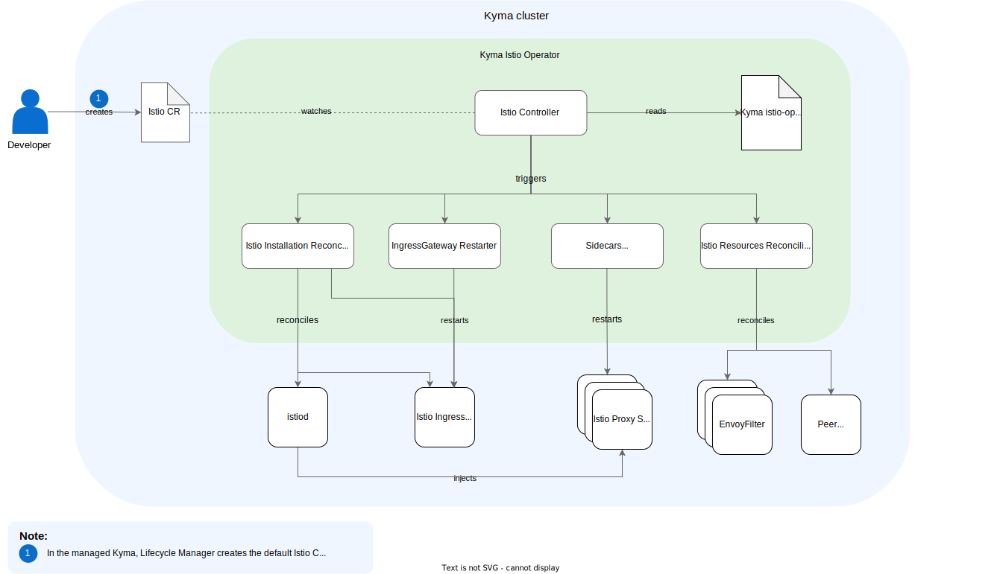

# Technical Design

## Kyma Istio Operator

Kyma Istio Operator implements one controller that consists of several self-contained reconciliation components. Splitting the logic into reconciliation components allows for 
better extensibility and maintainability. To achieve this requirement, each component must have its clearly separated responsibility and work in isolation when assessing whether reconciliation is required, applying changes, and returning a status.
To understand the reasons behind the technical design of the Kyma Istio Operator, refer to the [Architecture Decision Record](https://github.com/kyma-project/istio/issues/135).

The following diagram illustrates Kyma Istio Operator and its components:

## Istio Custom Resource

The [Istio custom resource (CR)](../user/04-00-istio-custom-resource.md) is a resource used to manage the Istio installation. The Istio CR is namespace-scoped because it was created and used before the introduction of Kyma Istio Operator.
However, the namespace-scoped approach has no particular benefit since the Kyma Istio Operator only supports a single Istio CR per cluster. Despite this, it is not possible to transition to a cluster-scoped model without introducing breaking changes.
As a consequence, only the oldest Istio CR in the `kyma-system` namespace is reconciled. Kyma Istio Operator does not reconcile other CRs in the `kyma-system` namespace or any CRs in other namespaces. Instead, it sets their status to 'Warning'.

## Istio Version

The version of Istio is coupled to the version of Kyma Istio Operator. This means that each particular version of Kyma Istio Operator is released to support only a specific version of Istio.
If you upgrade Kyma Istio Operator to a new version, it automatically updates Istio as well, provided that a more recent Istio version is part of the Kyma Istio Operator's release.

## Version Upgrade

You can upgrade Istio only by one minor version (for example, 1.2.3 -> 1.3.0). This requirement is also relevant when upgrading Kyma Istio Operator.
It is only allowed to skip a version of Kyma Istio Operator if the difference between the minor version of Istio it contains and the minor version of Istio you're using is not greater than one.

If the difference is greater than one minor version (for example, 1.2.3 -> 1.4.0), the reconciliation fails.
The same happens if you try to update the major version (1.2.3 -> 2.0.0) or downgrade the version. Such scenarios are not supported.

## Istio Controller

Istio Controller is a [Kubernetes controller](https://kubernetes.io/docs/concepts/architecture/controller/) implemented using the [Kubebuilder](https://book.kubebuilder.io/) framework.
Istio Controller manages and reconciles Istio CRs, which are in the `kyma-system` namespace.

### Reconciliation
The Istio CR is reconciled with each change to the **Spec** field. If you do not modify the field, the reconciliation process occurs at the default interval of 10 hours.
To adjust this interval, use [Istio Controller parameters](../user/technical-reference/05-00-istio-controller-parameters.md).
If the reconciliation process fails, [Kubernetes controller-runtime](https://pkg.go.dev/sigs.k8s.io/controller-runtime) uses exponential backoff requeue.

When Istio CR is deleted, Istio Controller uninstalls all Istio components. However, the uninstallation process can only proceed if there are no customer-created resources on the cluster.

Otherwise, Istio Controller logs the list of resources blocking the deletion and sets the Istio CR’s status to `Warning`.
The `istios.operator.kyma-project.io/istio-installation` finalizer protects the deletion of the Istio CR until you clean up all the orphaned resources. This behavior is known as the blocking deletion strategy.

As part of the reconciliation loop, the controller invokes the reconciliation components.
See the diagram:

## Reconciliation Components

Each reconciliation component must operate independently and make its own calculations without relying on the reconciliation of other components. It should only consider the state in a cluster and the Istio CR.

### Istio InstallationReconciliation

Istio InstallationReconciliation is responsible for managing the installation of Istio. This component creates the [IstioOperator CR](https://istio.io/latest/docs/reference/config/istio.operator.v1alpha1/) and uses it to apply changes to the Istio installation.
To create the IstioOperator CR, it merges Istio CR with IstioOperator, which contains the default values for Kyma.

#### Istio Installation

Istio InstallationReconciliation performs the Istio installation, upgrade, and uninstallation using the [Istio Go module](https://github.com/istio/istio).
It executes the installation of Istio as a synchronous and blocking call that checks the proper status of the installation. The reconciliation loop is blocked until Istio is installed. 
During each reconciliation, the component checks the installation of Istio. If Istio is not installed, it triggers the execution of the installation process.
As part of the installation, this component adds the finalizer `istios.operator.kyma-project.io/istio-installation` to Istio CR. This finalizer is only removed after Istio is successfully uninstalled.

#### Istio CR lastAppliedConfiguration
Istio InstallationReconciliation adds the `operator.kyma-project.io/lastAppliedConfiguration` annotation to the Istio CR and
updates it after each successful reconciliation. This annotation allows for comparing the current state of the Istio CR with its previous state.
If the component detects a change to a specific configuration, it performs corresponding actions, such as restarting the Istio Gateway.

#### Istio Ingress Gateway Restart
Istio InstallationReconciliation monitors changes in the `numTrustedProxies` configuration and restarts the Istio Ingress Gateway accordingly.
Whenever the component detects a change in the `numTrustedProxies` configuration, it restarts the Pods within the `istio-system/istio-ingressgateway` Deployment.

### Istio ResourcesReconciliation

Istio ResourcesReconciliation is responsible for applying resources dependent on Istio, such as VirtualService or EnvoyFilter, and ensuring that the state of the Istio service mesh is configured correctly based on these resources.
To maintain the correct state, the component provides [Restart Predicates](#restart-predicates) on a per-resource basis, which the [IngressGatewayReconciler](#ingressgatewayreconciler) and [ProxySidecarReconciliation](#proxysidecarreconciliation) components consume.

When the Istio InstallationReconciliation component reconciles resources that are not Istio resources, it sets their OwnerReference to the Istio CR.
As a result, if you remove the Istio CR, any associated resources that would normally remain on the cluster are also deleted.

### ProxySidecarReconciliation

The ProxySidecarReconciliation component is responsible for keeping the proxy sidecars in the desired state. It restarts Pods that are part of the service mesh or
that must be added to the service mesh.
The Istio CR and [Istio Version](#istio-version) represent the desired state.

This component covers the following restart triggers:

- Restart Pods with proxy sidecar when CNI config changes.
- Restart Pods with proxy sidecar after an Istio version update.
- Restart Pods with proxy sidecar when proxy resources change.
- Restart Pods if they match [Restart Predicates](#restart-predicates) that the [Istio ResourcesReconciliation component](#istio-resourcesreconciliation) specifies (for example, being up-to-date with EnvoyFilter).

### IngressGatewayReconciler

IngressGatewayReconciler is responsible for restarting Istio Ingress Gateway. The component consumes a list of [Restart Predicates](#restart-predicates) that determine when the restart should occur.

## Restart Predicates

The [IngressGatewayReconciler](#ingressgatewayreconciler) and [ProxySidecarReconciliation](#proxysidecarreconciliation) components use Restart Predicates.
Depending on the implemented interfaces, a predicate can trigger a restart of Ingress Gateways, Proxy Sidecars, or both Ingress Gateways and Proxy Sidecars.

For cases where it isn't trivial to check whether the configuration has been applied to the cluster state, Restart Predicates use a timestamp-based approach. For example, the `envoy_filter_allow_partial_referer` resource has the `istios.operator.kyma-project.io/updatedAt` annotation, which includes the timestamp of its last update.
The predicate initiates a restart of the sidecar and Ingress Gateway if the target was created before this timestamp.
