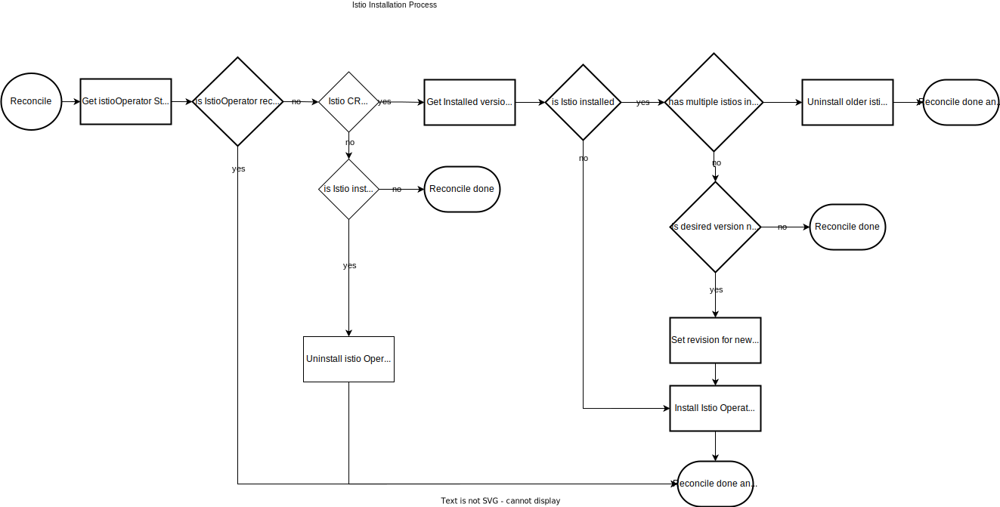
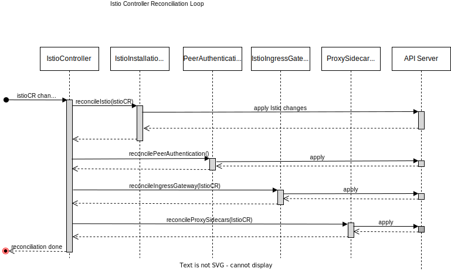
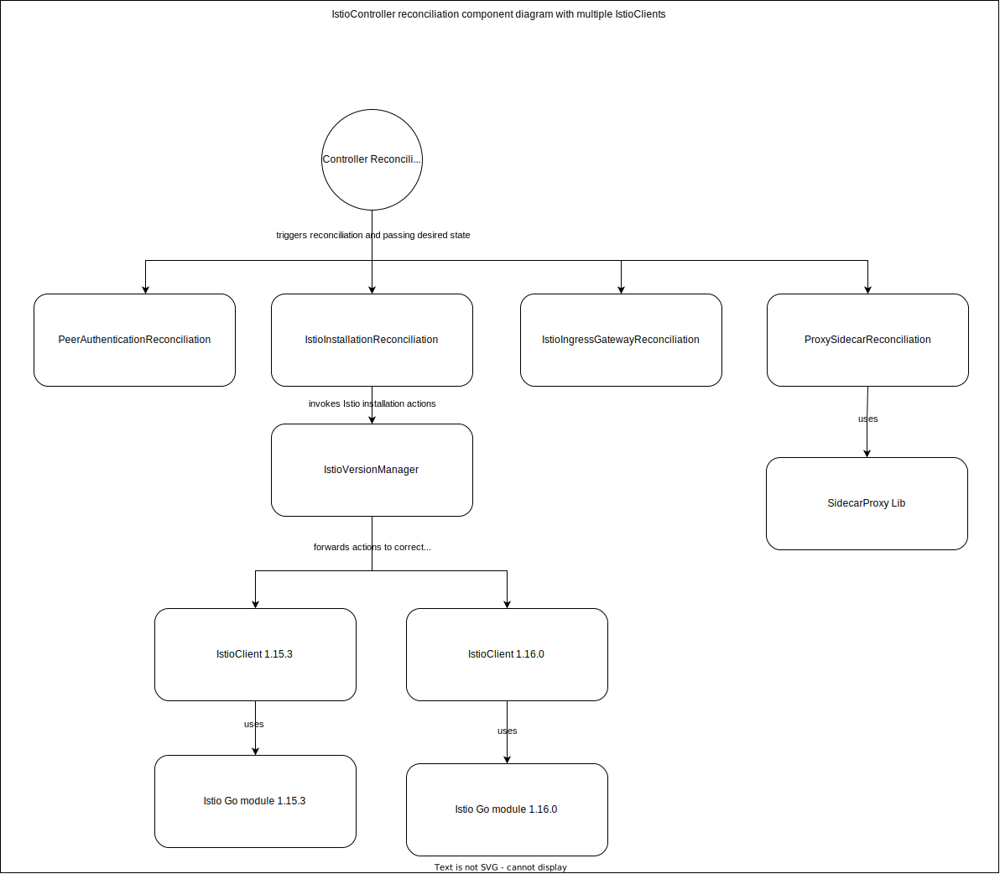

# Technical Design

## To be discussed


## Kyma Istio operator


We want to keep the operator as simple as possible, that's why we decided to start with one controller that consists of self-contained components 
executing reconciliation logic. The resource used by this controller is [Istio CR](https://github.com/kyma-project/istio/blob/main/docs/xff-proposal.md).

### Ownership of current resources in Kyma repository

In the transitioning to a more modularised architecture, the [IstioOperator resource](https://github.com/kyma-project/kyma/tree/main/resources/istio), 
the [additional istio-resources](https://github.com/kyma-project/kyma/tree/main/resources/istio-resources) and 
the [certificates](https://github.com/kyma-project/kyma/tree/main/resources/certificates) must be moved to the new modules.

#### IstioOperator resource
This is moved into our new Kyma Istio operator and used to define the default values for Istio, which can be customised by the user through `Istio CR`.

#### istio-resources

##### Istio Grafana dashboards
It's still needs to be decided who will have the ownership of the dashboards. There are different things to consider like the change interval or relevance of Istio version updates.

##### Istio ServiceMonitor
We will not consider theis resource in this design, because it's planned to replace it. 
More information can be found in this [PR](https://github.com/kyma-project/kyma/pull/16247).

##### istio-healthz Virtual Service
This resource offers the possibility to monitor Istio externally by exposing an endpoint. This should not be part of the Istio module,
and therefore a user who needs this external monitoring should take care of this particular configuration.

##### Global mTLS PeerAuthentication
This is tightly coupled to our Istio installation and should therefore be reconciled by the operator.

##### Kyma Gateway
This should be moved to the API Gateway as it's a default gateway we want to provide, and it has a stronger relation to the responsibilities
of the API Gateway that to Istio. Since API Gateway is already dependent on Istio, we do not add any additional dependency by moving it. 

#### Certificate resources
They should also be moved to API Gateway as they are tightly coupled with the `Kyma Gateway` resource.

### Handling of Istio version
We don't want to expose the version. That means that the version of Istio is coupled to the version of the operator. The benefit of this is,
that we are in full control of the versioning and hide this complexity from the user.  
That means if we want to release a new Istio version, we have to release a new version of the operator.

### Installation of Istio
The Istio installation, upgrade and uninstall is done using [Istio Go module](https://github.com/istio/istio).
The evaluation of Istio's installation options in an operator was done in this [PR](https://github.tools.sap/xf-goat/kyma-istio-operator). The result was that the best way for our use case was to use the
[Istio Go module](https://github.com/istio/istio) to use directly.  
In the sample implementation, the [istio.Install function](https://github.tools.sap/xf-goat/kyma-istio-operator/blob/ec0f99786408407b4a6d8b79abe3af6c389cd35d/controllers/servicemesh_controller.go#L73) of the 
Istio operator is used for installation. This causes Istio to be installed in a synchronous way, i.e. the reconciliation loop is blocked until Istio is installed, which can take several minutes.
For this reason, we have decided to install the operator and CR separately, as this does not lead to a long blocking of the reconciliation loop of our controller.

The [IstioOperator of Istio](https://github.com/istio/istio/tree/master/operator) is installed in the cluster with the command [operator init](https://istio.io/latest/docs/reference/commands/istioctl/#istioctl-operator-init)([Go implementation](https://github.com/istio/istio/blob/master/operator/cmd/mesh/operator-init.go)).
An example of how this can be done can be found [here](https://github.tools.sap/xf-goat/kyma-istio-operator/blob/62b81c82fb2120f9b67003b22c39f10a3e6fffc3/controllers/servicemesh_controller.go#L80). After the `IstioOperator` is installed, 
we can apply the `IstioOperator CR` for the initial installation or updates of the CR.
The `operator init` command can also be used to install a specific revision (required for canary upgrades) or to use a customised operator image.
An installed operator can be removed with the command [operator remove](https://istio.io/latest/docs/reference/commands/istioctl/#istioctl-operator-remove)([Go implementation](https://github.com/istio/istio/blob/master/operator/cmd/mesh/operator-remove.go)).

The command `operator init` applies the CRDs and the `IstioOperator` to the cluster. The deployment can take a few seconds. This is something you would normally want to avoid in a tuning loop, but as 
this only happens during the installation, upgrade or uninstallation of the `IstioOperator`, we feel that for convenience it makes sense to run a longer reconciliation loop in this case.
 
The following diagram describes the reconciliation process for installing, uninstalling and canary upgrading (using revisions) of Istio.



### Reconciliation of Istio
The reconciliation loop of Istio is based on the [Istio CR](https://github.com/kyma-project/istio/blob/main/docs/xff-proposal.md) custom resource and is controlled by the `IstioController`. This controller contains several self-contained components, which we have suffixed with reconciliation.   
We decided to split the logic in these reconciliation components to have a better extensibility and maintainability. This means each of this components must have its clearly separated responsibility
and must work in isolation when assessing whether reconciliation is required, applying changes and returning a status.  
The execution the reconciliation must be fast, and we must avoid many blocking calls. If we have long-running tasks, they must be executed asynchronously and the status should be evaluated in the next reconciliation cycle.

 The reconciliation loop of `IstioController` is visualized in the following diagram.


#### Interval

Since this module deals with security-related topics, we want to perform the reconciliation as often as possible.
This means that we do not only want to reconcile when [Istio CR](https://github.com/kyma-project/istio/blob/main/docs/xff-proposal.md) changes, but also want to check time-based that resources have not been changed and are in the expected state.  
The default reconciliation frequency of a manager is defined by the [SyncPeriod](https://pkg.go.dev/sigs.k8s.io/controller-runtime/pkg/manager#Options) and is set to 10 hours by default.
So one option is to change the `SyncPeriod` to match the desired reconciliation interval.
Another option is to always return `RequeueAfter` in the result of the Reconcile function to trigger the next reconciliation:
```go
func Reconcile(ctx context.Context, o reconcile.Request) (reconcile.Result, error) {
	// Implement business logic of reading and writing objects here
	return reconcile.Result{RequeueAfter: : 5 * time.Minute}, nil
}
```

The biggest challenge in deciding on an appropriate interval is that the time required to perform the reconciliation can vary a lot. Small changes may only require a 
restart of the sidecar proxies or the Ingress gateway and are therefore much faster than a new installation or a Canary upgrade.

We can start with using `SyncPeriod` set to 5 minutes as we only want to have a single controller for now and if it's no problem to start with a higher time-based reconciliation. When we add more controllers we can use `RequeueAfter` if
they should be triggered on different intervals or if we want to have a different interval while a long running-process like installation is executed.

The queuing of reconciliation requests is handled by [controller-runtime](https://pkg.go.dev/sigs.k8s.io/controller-runtime) and is out of scope of this design.

### Components
We need to make sure that each reconciliation component is completely independent and can calculate what to do during the reconciliation, independent of the reconciliation of other components and based only on the state in the cluster.
The reason for this is that, for the sake of simplicity, we want to start with just one controller that handles all the logic to reconcile Istio. But since we have independent components, we can move them into new controllers if necessary to
improve the performance of `IstioController`.


#### IstioController
This is the controller that takes care of the entire Istio reconciliation process and is bound to [Istio CR](https://github.com/kyma-project/istio/blob/main/docs/xff-proposal.md).
The responsibility is to control the reconciliation process by triggering the reconciliation components and passing the desired state to them.

#### IstioInstallationReconciliation
This component decides if an installation, upgrade or uninstall of Istio in the cluster must be done. It also creates the [IstioOperator CR](https://istio.io/latest/docs/reference/config/istio.operator.v1alpha1/)
which is used to apply changes to the Istio installation. The applied `IstioOperator CR` is created by merging the `Istio CR` with the IstioOperator with Kyma default values.

##### IstioClient
A IstioClient encapsulates a specific version of the [Istio Go module](https://github.com/istio/istio) and is used to implement calls to the Istio API.
This component also contains the logic to carry out Istio actions like install, upgrade and uninstall (described [here](#installation-of-istio)).
As we want to support canary updates at some point we might need to support two version of the library if there are breaking changes. In this case the `IstioVersionManager` needs to handle
the supported versions of the `IstioClient`.

##### IstioVersionManager
In case of breaking changes we may need to use the correct [Istio Go module](https://github.com/istio/istio) version for the installed [IstioOperator](https://github.com/istio/istio/tree/master/operator).
If we need to support this scenario, this should be handled by an `IstioClient` for each version. The `IstioVersionManager` will act as the abstraction layer of the `IstioClient` by mapping 
the requests to the correct version of the `IstioClient`.  
For the first simple implementation, we can probably do without the `IstioVersionManager` for now.



#### ProxySidecarReconciliation
The responsibility of this component is to keep the proxy sidecars in the desired state. This means that it restarts pods that are part of the service mesh or 
that need to be added to the service mesh.
The desired state is represented by [Istio CR](https://github.com/kyma-project/istio/blob/main/docs/xff-proposal.md) and the Istio Version coupled to the Operator.
This component carries a high risk that its execution takes too long for synchronous execution in the controller. We need to check its performance during implementation 
and assess whether its logic needs to be executed asynchronously, e.g. as part of a job or a cron job.

As of now the following scenarios must be covered by this component:
- Restart pods with proxy sidecar when CNI config changed
- Restart pods with proxy sidecar after Istio version update
- Restart pods without proxy sidecar, because of Istio downtime
- Restart pods with proxy sidecar when proxy resources change

#### IstioIngressGatewayReconciliation
The components responsibility is to bring the Istio Ingress Gateway in the desired state.
The desired state is represented by [Istio CR](https://github.com/kyma-project/istio/blob/main/docs/xff-proposal.md).

As of now the following scenarios must be covered by this component:
- Restart when `numTrustedProxies` changed.
  - To decouple the restart from the rollout of the `numTrustedProxies` by the `IstioInstallationReconciliation`, a state (e.g. an annotation) should be use.

#### PeerAuthenticationReconciliation
This component applies a PeerAuthentication that configures the default mTLS mode in the cluster.
This should only be applied if Istio is installed, and this PeerAuthentication does not exist or the generation has been changed, as we want to ensure that it is always our expected configuration.


## Scenario: Users bring their own Istio installation
In this scenario the API Gateway would support defined Istio versions. A user can then install one of the supported istio versions.
There should be a documentation to explain what needs to be configured to expose a ServiceMonitor for the monitoring module.