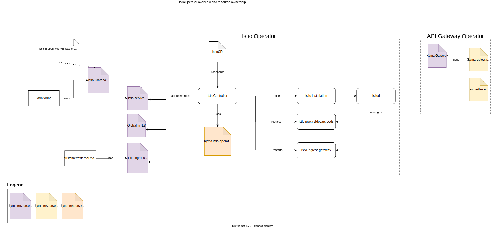
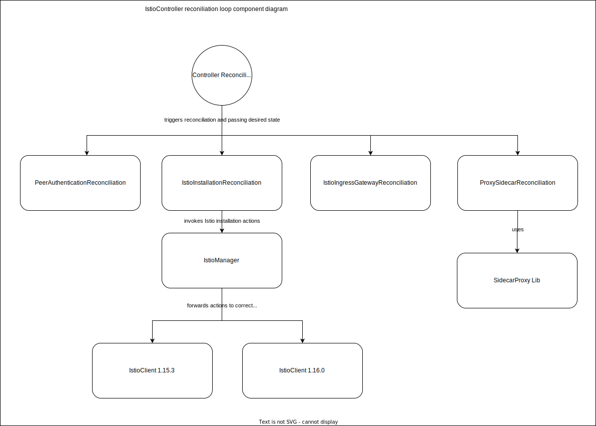

# Technical Design

## To be discussed


## Istio operator



### Ownership of current resources in Kyma repository

In the transitioning to a more modularised architecture, the [IstioOperator resource](https://github.com/kyma-project/kyma/tree/main/resources/istio), 
the [additional istio-resources](https://github.com/kyma-project/kyma/tree/main/resources/istio-resources) and 
the [certificates](https://github.com/kyma-project/kyma/tree/main/resources/certificates) must be moved to the new modules.

#### IstioOperator resource
This is moved into our new Istio operator and used to define the default values for Istio, which can be customised by the user through `IstioCR`.

#### istio-resources

##### Istio Grafana dashboards
It's still needs to be decided who will have the ownership of the dashboards. There are different things to consider like the change interval or relevance of Istio version updates.

##### Istio ServiceMonitor
We will not consider theis resource in this design, because it's planned to replace it. 
More information can be found in this [PR](https://github.com/kyma-project/kyma/pull/16247).

##### istio-healthz Virtual Service
This resource provides monitoring capability for the Istio installation and should therefore be reconciled by the operator.

##### Global mTLS PeerAuthentication
This is tightly coupled to our Istio installation and should therefore be reconciled by the operator.

##### Kyma Gateway
This should be moved to the API Gateway as it's a default gateway we want to provide, and it has a stronger relation to the responsibilities
of the API Gateway that to Istio. Since API Gateway is already dependent on Istio, we do not add any additional dependency by moving it. 

#### Certificate resources
They should also be moved to API Gateway as they are tightly coupled with the `Kyma Gateway` resource.

### Handling of Istio version
We don't want to expose the version. That means that the version of Istio is coupled to the version of the operator. The benefit of this is,
that we are in full control of the versioning and hide this complexity from the user.  
That means if we want to release a new Istio version, we have to release a new version of the operator.

### Installation & Upgrade of Istio
The Istio installation, upgrade and uninstall is done using [Istio Go module](https://github.com/istio/istio).

### Reconciliation of Istio
The reconciliation loop of Istio is based on the [IstioCR](https://github.com/kyma-project/istio/blob/main/docs/xff-proposal.md) custom resource and is controlled by the `IstioController`. This controller contains multiple self-contained components we decided to call reconcilers.   
We decided to split the logic in these reconcilers to have a better extensibility and maintainability. This means each of this reconcilers must have its clearly separated responsibility
and must work in isolation when assessing whether reconciliation is required, applying changes and returning a status.  

Although we want the reconcilers to be as decoupled and independent as possible, there is an execution dependency as we first need to install/upgrade Istio ( done by `IstioInstallationReconciler`)
before the other reconcilers can be executed.

#### Interval

Since this module deals with security-related topics, we want to perform the reconciliation as often as possible.
This means that we do not only want to reconcile when [IstioCR](https://github.com/kyma-project/istio/blob/main/docs/xff-proposal.md) changes, but also want to check time-based that resources have not been changed and are in the expected state.  
The default reconciliation frequency of a manager is defined by the [SyncPeriod](https://pkg.go.dev/sigs.k8s.io/controller-runtime/pkg/manager#Options) and is set to 10 hours by default.
So one option is to change the `SyncPeriod` to match the desired reconciliation interval.
Another option is to always return `RequeueAfter` in the result of the Reconcile function to trigger the next reconciliation:
```go
func Reconcile(ctx context.Context, o reconcile.Request) (reconcile.Result, error) {
	// Implement business logic of reading and writing objects here
	return reconcile.Result{RequeueAfter: : 5 * time.Minute}, nil
}
```

The biggest challenge in deciding on an appropriate interval is that the time required to perform the reconciliation can vary a lot. Small changes may only require a 
restart of the sidecar proxies or the Ingress gateway and are therefore much faster than a new installation or a Canary upgrade.  
Given this dynamic in execution, we must always consider the slowest reconciliation process when defining `SyncPeriod`. Also, we have to consider that if we later add another controller to this operator, this new controller will also use the same frequency.  
Using `RequeueAfter` on the other hand gives us more freedom, but also makes it a bit more complex to understand what is being done and why.

We have decided to use `RequeueAfter` with a frequency of 5 minutes, as this gives us the ability to perform the matching as often as possible without the risk of repeatedly checking the slowest reconciliation process or piling up requests in the reconciliation queue.

The queuing of reconciliation requests is handled by [controller-runtime](https://pkg.go.dev/sigs.k8s.io/controller-runtime) and is out of scope of this design.

### Components


#### IstioController
This is the controller that takes care of the entire Istio reconciliation process and is bound to [IstioCR](https://github.com/kyma-project/istio/blob/main/docs/xff-proposal.md).
The responsibility of this controller is to fetch the current configuration and pass it on to the reconcilers together with the desired configuration. 
It also controls the reconciliation process by running the reconcilers considering the execution dependencies between them.

#### IstioInstallationReconciler
This reconciler decides if an installation, upgrade or uninstall of Istio in the cluster must be done. The reconciler also creates the IstioOperator
which is used to make changes to the Istio installation by passing it to the `IstioManager`.

The installed IstioOperator is created by merging the `IstioCR` with the IstioOperator with Kyma default values.

##### IstioManager
This component contains the logic for managing the Istio installation. It knows about the supported client versions and forwards the 
Istio API requests (e.g. Install, Upgrade) to the correct version of `IstioClient` if there are breaking changes.  
Depending on how the Istio Go module behaves, it may not be necessary to support multiple clients for the time being. For the first simple implementation, we can probably do without the IstioManager for the time being.

##### IstioClient
A IstioClient encapsulates a specific version of the [Istio Go module](https://github.com/istio/istio). 
As we want to support canary updates at some point we might need to support two version of the library if there are breaking changes.

#### ProxySidecarReconciler
This reconciler must be executed after the `IstioInstallationReconciler`. Its responsibility is to restart pods based on specific configuration changes.

As of now the following scenarios must be covered by this reconciler:
- Restart pods with proxy sidecar when CNI config changed
- Restart pods with proxy sidecar after Istio version update
- Restart pods without proxy sidecar, because of Istio downtime
- Restart pods with proxy sidecar when proxy resources change

#### IstioIngressGatewayReconciler
This reconciler must be executed after the `IstioInstallationReconciler`. Its responsibility is to restart the Istio ingress gateway ingress gate  based on specific configuration changes.

As of now the following scenarios must be covered by this reconciler:
- Restart when `numTrustedProxies` changed.

#### MonitoringReconciler
This reconciler must be executed after the `IstioInstallationReconciler` and it applies resources for monitoring the istio installation.

As of now the following resources are part of the monitoring:
- `VirtualService` for monitoring of the Istio health by an external system

#### PeerAuthenticationReconciler
This reconciler must be executed after the `IstioInstallationReconciler` and it applies a PeerAuthentication that configures
the default mTLS mode in the cluster.


## Scenario: Users bring their own Istio installation
In this scenario the API Gateway would support defined Istio versions. A user can then install one of the supported istio versions.
There should be a documentation to explain what needs to be configured to expose a ServiceMonitor for the monitoring module.