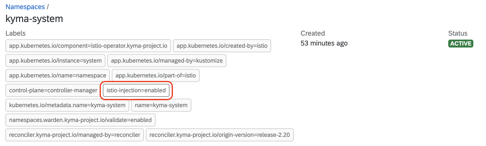

# Check if you have Istio sidecar proxy injection enabled

## Check if sidecar injection is enabled in the Pod's Namespace

<!-- tabs:start -->

#### **kubectl**
Run the following command to check if the Pod's Namespace is labeled with `istio-injection=enabled`:

    ```bash
    kubectl get namespaces {NAMESPACE} -o jsonpath='{ .metadata.labels.istio-injection }'
    ```
If the command does not return `enabled`, the sidecar injection is disabled in this Namespace.

#### **Kyma Dashboard**

1. Go to the Pod's Namespace.
2. Verify if the labels section contains `istio-injection=enabled`. If the section doesn't contain the label, the sidecar injection is disabled in this Namespace.
   Here's an example of a Namespace where the Istio sidecar proxy injection is enabled:
   

<!-- tabs:end -->

## Check if sidecar injection is enabled in the Pod's Deployment

<!-- tabs:start -->

#### **kubectl**

Run the following command to check if a Deployment is labeled with `istio-injection=enabled`:

    ```bash
    kubectl get deployments {DEPLOYMENT_NAME} -n {NAMESPACE} -o jsonpath='{ .spec.template.metadata.labels }'
    ```
Sidecar injection is disabled if the output does not contain the `sidecar.istio.io/inject:true` line.

#### **Kyma Dashboard**

1. Go to the Deployment's Namespace.
2. On the left-hand side sidebar, find the **Workloads** section and select **Deployments**.
3. Utilize the search function to filter for all Deployments labeled with `istio-injection=enabled`.


<!-- tabs:end -->


## Use the script to list all Pods with sidecar injection enabled

You can also check whether your workloads have automatic Istio sidecar injection enabled by running [the script](../../../assets/sidecar-analysis.sh). Either pass the **namespace** parameter to the script or run it with no parameter.

* If you don't provide any parameter, the execution output contains Pods from all Namespaces that don't have automatic Istio sidecar injection enabled. The script outputs the information in the format of `{NAMESPACE}/{POD}`. Run:

    ```bash
    ./sidecar-analysis.sh
    ```

  You get an output similar to this one:

    ```
    Pods out of istio mesh:
      In namespace labeled with "istio-injection=disabled":
        - sidecar-disabled/some-pod
      In namespace labeled with "istio-injection=enabled" with pod labeled with "sidecar.istio.io/inject=false":
        - sidecar-enabled/some-pod
      In not labeled ns with pod not labeled with "sidecar.istio.io inject=true":
        - no-label/some-pod
    ```

*  If you pass a parameter, only the Pods from the specified Namespace are analyzed. The script outputs the information in the format of `{POD}` if run for a specific Namespace. Run:

    ```bash
    ./sidecar-analysis.sh {NAMESPACE}
    ```
    You get an output similar to this one:

    ```
    Pods out of istio mesh in namespace {NAMESPACE}:
      - some-pod
    ```

For more information, see the [Sidecar injection problems](https://istio.io/docs/ops/common-problems/injection/).